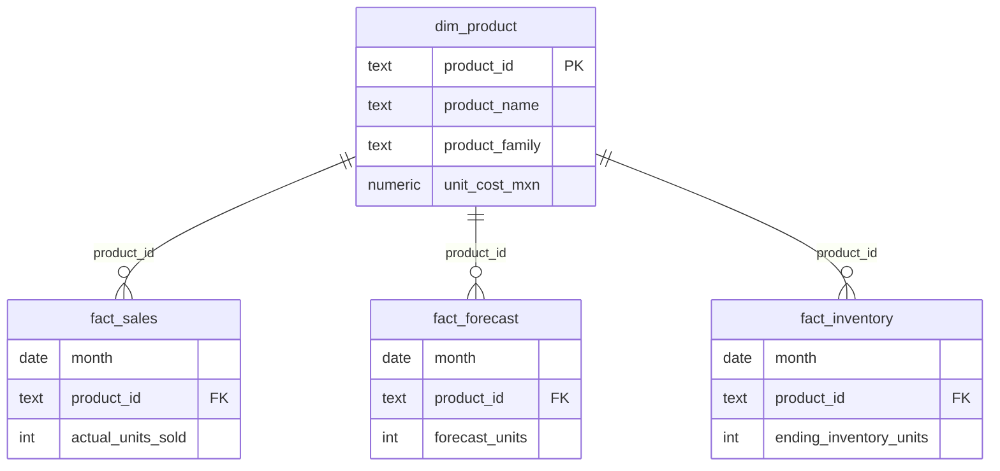

# 🏗️ Data Architecture

This document describes the technical architecture of the Forecast & Inventory Risk Analytics Project.

---

# 1️⃣ Architecture Overview

The project follows a layered data architecture to ensure scalability, reproducibility, and metric consistency.

Raw Data → Staging Layer → Fact Tables → Semantic Layer (Views) → BI Layer

---

# 2️⃣ Layer Description

## 🔹 Raw Data Layer

Source files:
- Daily sales data
- Monthly forecast data
- Monthly inventory snapshots
- Product master data

Format:
- CSV files generated or simulated via Python

Purpose:
Serve as the initial ingestion point.

---

## 🔹 Staging Layer

Tables:
- stg_fact_sales
- stg_fact_forecast
- stg_fact_inventory

Purpose:
Temporary landing tables used to validate and standardize incoming data before merging.

Design Decision:
Staging ensures idempotent loads and protects production fact tables.

---

## 🔹 Core Fact Tables

Tables:
- fact_sales
- fact_forecast
- fact_inventory

Granularity:
Monthly, SKU-level (month, product_id)

Constraints:
- Unique constraint on (month, product_id)
- Foreign key to dim_product

Purpose:
Store clean, structured transactional data.

---

## 🔹 Dimension Table

Table:
- dim_product

Purpose:
Provide descriptive attributes:
- Product family
- Product name
- Unit cost

Used for aggregation and financial valuation.

---

## 🔹 Semantic Layer (SQL Views)

Views:
- v_master
- v_metrics

Purpose:
Centralize metric logic and transformations.

Benefits:
- Avoid metric duplication in Power BI
- Ensure consistent KPI definitions
- Simplify BI consumption

Example transformations:
- Absolute error
- MAPE
- DOI
- Inventory value

---

## 🔹 BI Layer

Tool:
Power BI Desktop

Data Source:
v_metrics

Responsibilities:
- KPI visualization
- Drill-down capability
- Stakeholder storytelling
- Risk prioritization dashboards

Important:
No complex metric logic should be defined only in BI.
Business logic remains centralized in SQL.

---

# 3️⃣ Data Model

Granularity: Monthly | SKU-Level

---

# 4️⃣ Incremental Data Strategy

The project supports incremental monthly updates using:

1. Staging tables
2. UPSERT logic
3. Unique constraints

Process:
1. Load new month into staging tables
2. Execute UPSERT
3. Views automatically update

This design ensures:
- No duplicate records
- Safe re-runs
- Consistent historical integrity

---

# 5️⃣ Design Principles

- Separation of concerns (data vs visualization)
- Metric logic centralized in SQL
- Idempotent data loads
- Financial prioritization
- Portfolio-level weighted metrics

---

# 6️⃣ Scalability Considerations

If deployed in a production environment:

- Replace CSV ingestion with automated ETL
- Introduce weekly or daily granularity
- Move database to cloud (AWS RDS / Azure / GCP)
- Implement role-based access
- Add automated data validation checks

---

# 7️⃣ Future Enhancements

- Rolling forecast integration
- Supplier lead-time modeling
- Service-level optimization
- Alert-based risk monitoring
- Automated refresh scheduling

---
