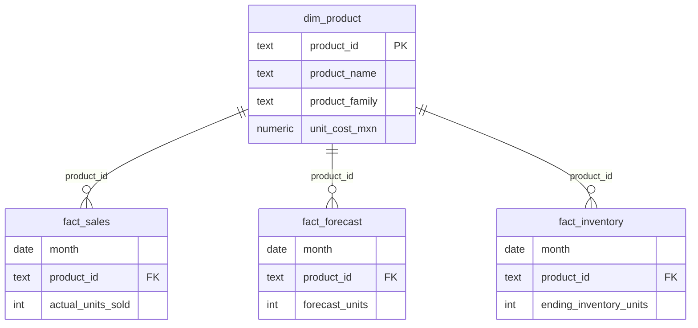

# 🔧 Technical Documentation

This document summarizes the technical implementation of the Forecast & Inventory Risk Analytics project.

---

# 1️⃣ Data Model

Granularity: Monthly | SKU-Level

Core Tables:
- dim_product
- fact_sales
- fact_forecast
- fact_inventory

Primary Key:
(month, product_id)

Foreign Key:
fact tables → dim_product

---

# 2️⃣ Data Loading Strategy

The project supports incremental monthly updates through:

1. Staging tables
2. Unique constraints
3. UPSERT logic

Process:
- Load new month into staging
- Execute merge (ON CONFLICT DO UPDATE)
- Views automatically refresh

This ensures:
- No duplicates
- Safe re-runs
- Historical integrity

---

# 3️⃣ Metric Engineering (SQL Layer)

All KPIs are defined in SQL views to ensure consistency.

Core View:
v_metrics

Key Calculations:

Absolute Error:

$$| \ Actual \ - \ Forecast \ |$$

Weighted MAPE:

$$ \frac{ \sum { \left( | \text{Actual Units Sold} \: - \: Forecast| \right) } } { \sum { ( \text{Actual Units Sold} ) } } $$

Days of Inventory:

$$ \left( \frac{ \text{Inventory Units} } { \text{Actual Demand} } \right) \left( 30 \right) $$

Inventory Value:

$$ \text{Inventory Units} \quad × \quad \text{Unit Cost} $$

Weighted DOI:

$$ \frac{ \sum{ \left( DOI \quad × \quad \text{Inventory Value} \right) } } { \sum{( \text{Inventory Value} )} } $$

---

# 4️⃣ Semantic Layer Design

The BI tool connects exclusively to SQL views.

Benefits:
- Avoid metric duplication
- Centralized business logic
- Clean separation of concerns
- Reusable KPI definitions

---

# 5️⃣ Dataset Reproducibility

Synthetic but realistic datasets are generated using:

/python/generate_historical_dataset.ipynb  
/python/generate_incremental_update.ipynb  

Portfolio constraints:
- Weighted MAPE ≈ 10–25%
- Average DOI ≈ 30–70 days
- SKU-level variability preserved

---

# 6️⃣ Scalability Considerations

In a production environment:

- Replace CSV ingestion with automated ETL
- Implement role-based database access
- Deploy database to cloud (AWS RDS / Azure / GCP)
- Introduce automated data validation checks

---
